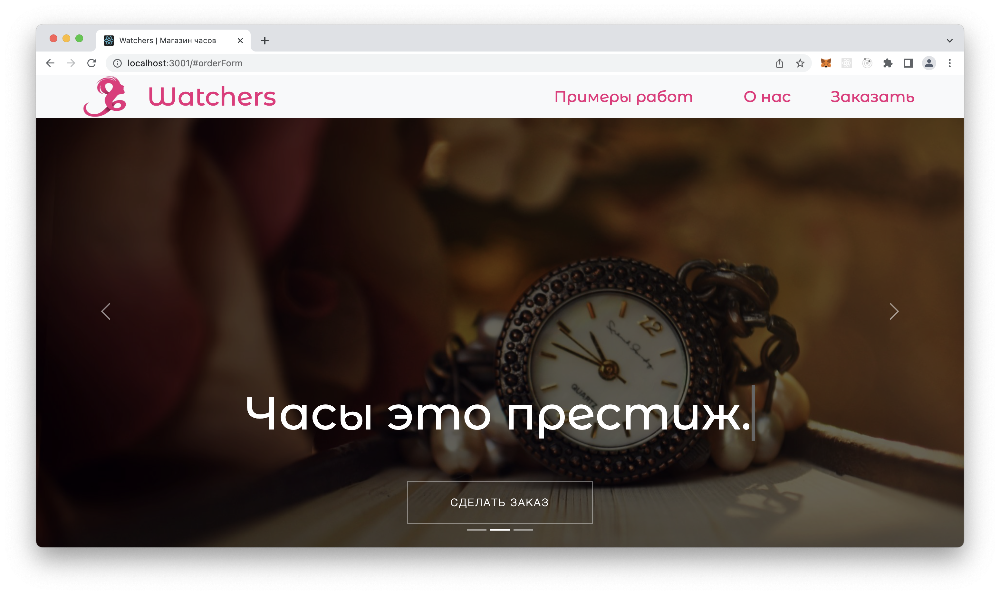
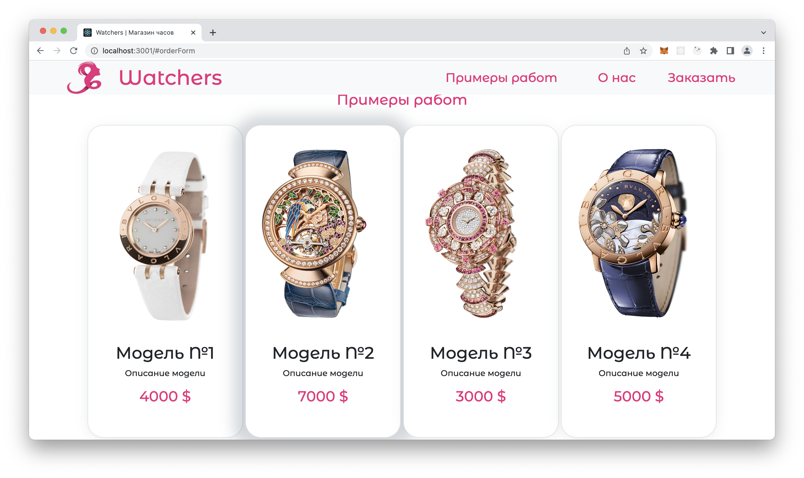
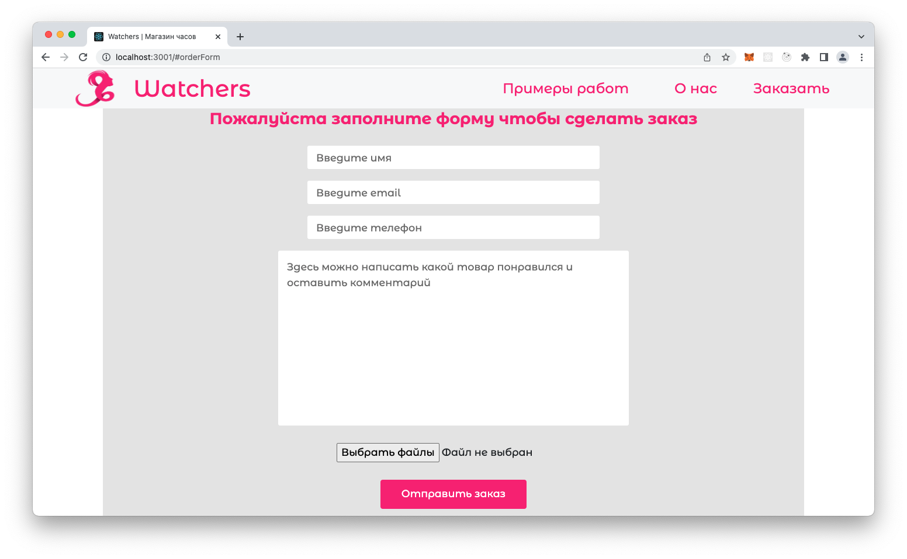
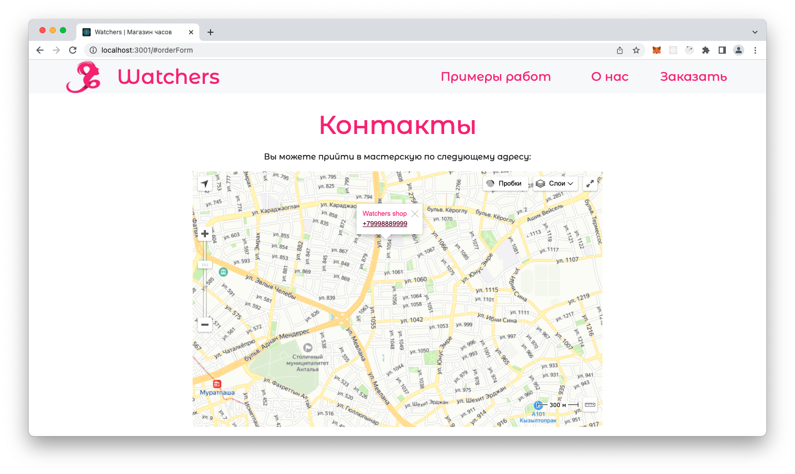
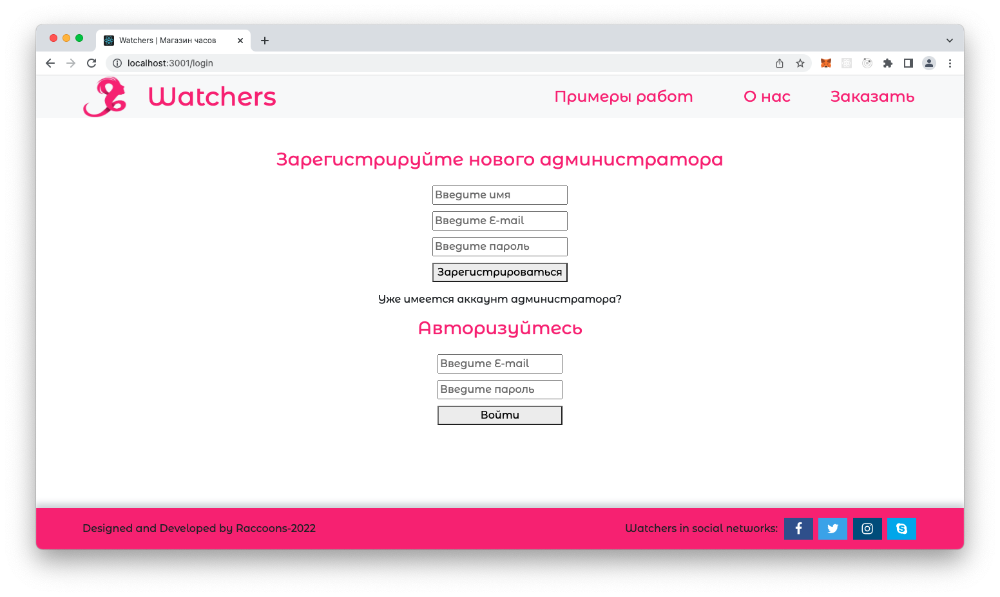
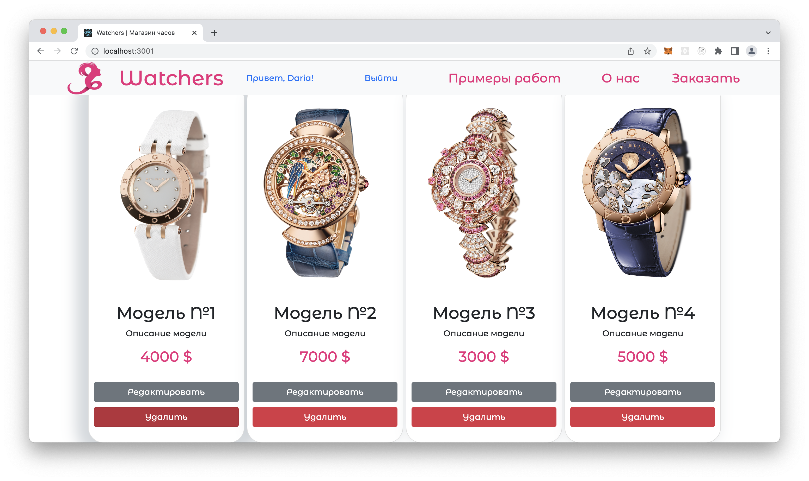
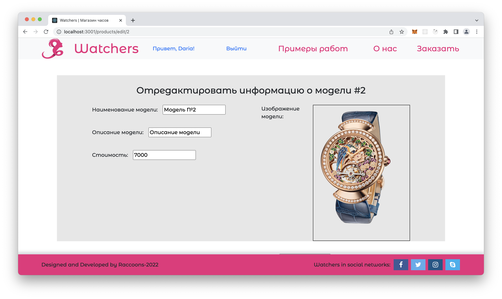
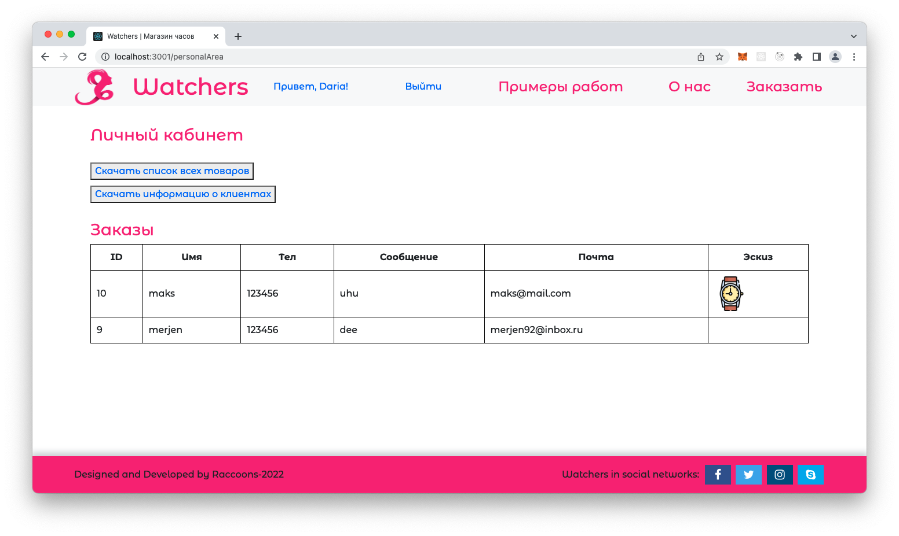

# WATCHERS workshop
### 🖥 Stack:
Node.js, Express, Handlebars, PostgreSQL, Sequelize, Bootstrap, Yandex maps API, Bcrypt, express-session, Nodemailer, Multer

---

My responsibilities:
- login, registration (Bcrypt, PostgreSQL, Sequelize, express-sessions)
- email to clients after publishing request (Nodemailer)
- cards with watch models + buttons for administrator for editing/deleting items
- deleting one card
- shop location on the map (Yandex maps API)

---

Current version is deployed **[here](https://wristwatches.herokuapp.com)** 

This is a one-page website for a watch workshop. We made it together with three of my colleagues during internship in Elbrus bootcamp. All git history you can find in the original repository https://github.com/IElizaI/project-from-the-client

The workshop Watchers make handmade watches. All watches are made individually for each client. 

On the main page clients can see examples of previous work, read about the company and leave a request if they want to order a watch. 
Clients can also attach photo or sketches for master in their request.

After receiving new request the website sends email to the client with notification that the request has been received.

There is also a map with shop's location and conctacts on the main page (created using Yandex maps API):

For administrators we created secret page via link '/admin'. Here new admin can make a request to become administrator, but can not login without approve. To give approve to new administrator, our superAdmin :) can change 'approved' column to 'true' value in the database, 'Admins' table.

Admin can edit cards with examples of watches, delete or create new card. 

In admin's private page admin can see the list of requests from users, and can also download the list of watch examples and the list of clients' contacts in CSV format.

